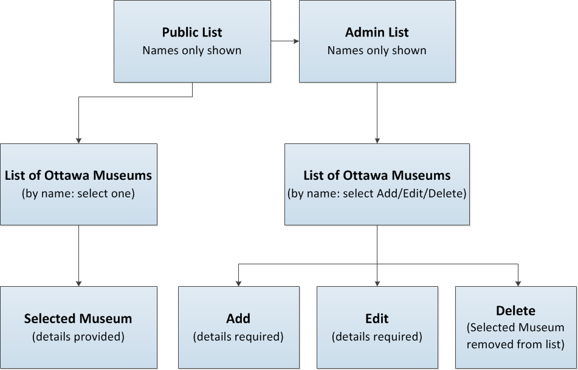

<link href="css/general.css" rel="stylesheet">
<title>Project Brief</title>

</head>
<body>
<h1>MTM1526 Open Data App - Project Brief</h1>
<h2>Description</h2>

This Data App is intended to provide an easily accessible and fully responsive webpage listing museums in the Nstional Capital Region (Ottawa/Hull).

<h2>Feature List</h2>

Museums will be listed primarily by their title, with details for each available upon one click of the name. Google Maps will provide a location marked according to longitude and latitude, provided in the database.

A private (password protected) Admin area will allow for additions, editing or deletion of museums and detailed information within the database.

<li 
<li><a href="http://jen-harris-open-data-app.phpfogapp.com">Link to PHP Fog</a></li>
<li><a href="https://github.com/JenLHarris/open-data-app">Link to Github</a></li>
<li><a href="http://ottawa.ca/online_services/opendata/info/museums_en.html">Link to Data Set</a></li>

<h2>User Persona</h2>

Sarah is travelling to Ottawa with her 3 children. Before she arrives she would like to outline some plans for outings, sorted by area so they can walk or cycle through one neighbourhood and plan day-long excursions around meals or visits with family and friends in various parts of the city.

<h2>Sitemap</h2>

<h2>Wireframe/Design Mockup</h2>

 

 

 

</body>
</html>
